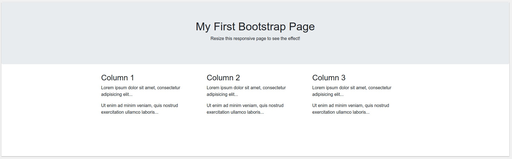

# Bootstrap


Bootstrap is a powerful front-end framework for faster and easier web development. It includes HTML and CSS based design templates for creating common user interface components like forms, buttons, navigations, dropdowns, alerts, modals, tabs, accordions, carousels, tooltips, and so on.

Bootstrap uses the BEM methodology to give style to the elements.

```markup
<div class="jumbotron text-center">
  <h1>My First Bootstrap Page</h1>
  <p>Resize this responsive page to see the effect!</p>
</div>

<div class="container">
  <div class="row">
    <div class="col-sm-4">
      <h3>Column 1</h3>
      <p>Lorem ipsum dolor..</p>
    </div>
    <div class="col-sm-4">
      <h3>Column 2</h3>
      <p>Lorem ipsum dolor..</p>
    </div>
    <div class="col-sm-4">
      <h3>Column 3</h3>
      <p>Lorem ipsum dolor..</p>
    </div>
  </div>
```

Here we have a HTML file with Bootstrap in it. We can see that every class have a property, this is the way we give styles without a CSS to an HTML file. This HTML produces the following:



In the HTML we see that we give to the class `jumbotron` to the _div_ that gives it a grey background and the font size, and with `text-center` we center the text in the center of the _div_.

Then we create a grid by creating the `container` and one `row` in it, as our grid will only have one row.

After creating the container and the row, Bootstrap give us 12 spaces in every row and we can distribute it as we need, for example, here we're giving an equal espace to the 3 columuns we need so the `col-sm-4` stands for `col` defines the column, `sm` define a style of the column and `4` defines how many space will take this column.

And thats the way to create styles with Bootstrap, there's a lot more parameters that we can use.

