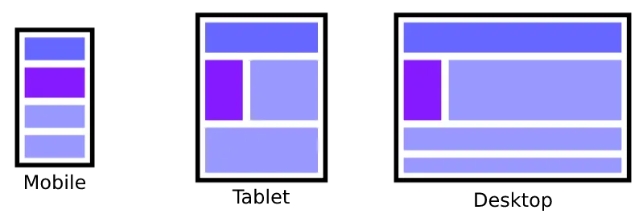

# Design

The design of the webpage will depend in the format that we're developing for, as a mobile have less space than a desktop the webpage will not be the same, in this diagram it's represented how the design should be in the differents devices.

We can design the web pages in two ways





