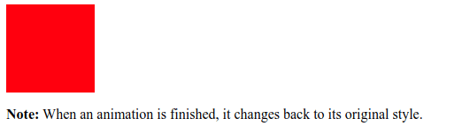
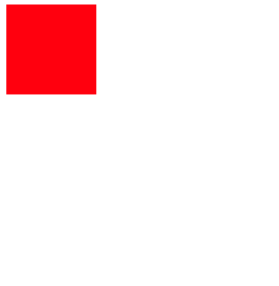
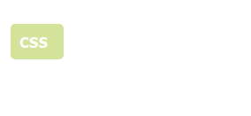
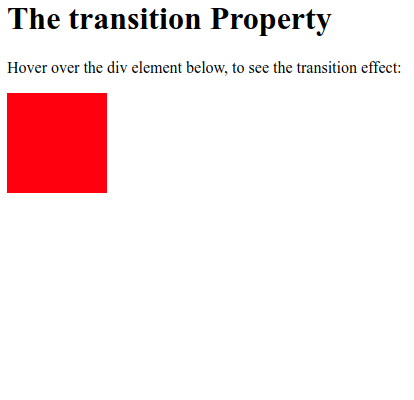
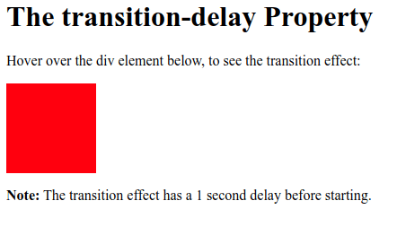

# Animations and Transitions

## Animations

CSS animations allows an alement to gradually change the style from another

With the `@keyframes` we specify what the animation will do, and with the `animation-name` we bind this `@keyframes` to the element. And with the `animation-duration`, we specify how much will take to complete the animation.



```markup
<html>
<body>

<div></div>

<p><b>Note:</b> When an animation is finished, it changes back to its original 
style.</p>

</body>
</html>
```



```css
div {
  width: 100px;
  height: 100px;
  background-color: red;
  animation-name: example;
  animation-duration: 4s;
}

@keyframes example {
  from {background-color: red;}
  to {background-color: yellow;}
}
```





We can delay the animation with the `animation-delay` property.

And we can even repeat the animation a certain amount of times with the `animation-iteration-count`.

And with the `animation` shorthand we can specify the following properties, in the following order:

1. `animation-name` specify the name of the aniimation
2. `animation-duration` how much it lasts the animation
3. `animation-timing-function`the speed curve that the animation will follow
4. `animation-delay` how much will take the animation to start
5. `animation-iteration-count` how many times will the animation occurrs
6. `animation-direction` which direction will follow the animation



```markup
</html>
<body>

<div></div>

</body>
</html>
```



```css
div {
  width: 100px;
  height: 100px;
  background-color: red;
  position: relative;
  animation: myfirst 5s linear 2s 3 alternate;
}

@keyframes myfirst {
  0%   {background-color:red; left:0px; top:0px;}
  25%  {background-color:yellow; left:200px; top:0px;}
  50%  {background-color:blue; left:200px; top:200px;}
  75%  {background-color:green; left:0px; top:200px;}
  100% {background-color:red; left:0px; top:0px;}
}
```





## Transitions

CSS transitions allows you to change property values smoothly, over a given duration.



In order to create a transition, we need to specify two parameters:

* The CSS property you want to add the effect to.
* The duration of the effect.



```markup
<html>
<body>

<h1>The transition Property</h1>

<p>Hover over the div element below, to see the transition effect:</p>
<div></div>
</body>
</html>
```



```css
div {
  width: 100px;
  height: 100px;
  background: red;
  transition: width 2s;
}

div:hover {
  width: 300px;
}
```




Also can even change various propery values at a time



```markup

<h1>The transition Property</h1>

<p>Hover over the div element below, to see the transition effect:</p>
<div></div>
</body>
</html>
```



```css
div {
  width: 100px;
  height: 100px;
  background: red;
  transition: width 2s, height 4s;
}

div:hover {
  width: 300px;
  height: 300px;
}
```





With `transition-timing-function` we can specify the speed of the curve of the transition effect.

We can specify the following values:

* `ease` - specifies a transition effect with a slow start, then fast, then end slowly \(this is default\)
* `linear` - specifies a transition effect with the same speed from start to end
* `ease-in` - specifies a transition effect with a slow start
* `ease-out` - specifies a transition effect with a slow end
* `ease-in-out` - specifies a transition effect with a slow start and end
* `cubic-bezier(n,n,n,n)` - lets you define your own values in a cubic-bezier function



```markup
<html>
<body>

<h1>The transition-timing-function Property</h1>

<p>Hover over the div elements below, to see the different speed curves:</p>

<div id="div1">linear</div><br>
<div id="div2">ease</div><br>
<div id="div3">ease-in</div><br>
<div id="div4">ease-out</div><br>
<div id="div5">ease-in-out</div><br>


</body>
</html>
```



```css
div {
  width: 100px;
  height: 100px;
  background: red;
  transition: width 2s;
}

#div1 {transition-timing-function: linear;}
#div2 {transition-timing-function: ease;}
#div3 {transition-timing-function: ease-in;}
#div4 {transition-timing-function: ease-out;}
#div5 {transition-timing-function: ease-in-out;}

div:hover {
  width: 300px;
}
```




We can even add a delay for the transition



```markup
<html>
<body>

<h1>The transition-delay Property</h1>

<p>Hover over the div element below, to see the transition effect:</p>

<div></div>

<p><b>Note:</b> The transition effect has a 1 second delay before starting.</p>


</body>
</html>

```



```css
div {
  width: 100px;
  height: 100px;
  background: red;
  transition: width 3s;
  transition-delay: 1s;
}

div:hover {
  width: 300px;
}
```





We have the shorthand `transition`to specify all the parameters, with just one word. We need to put `transition: transition-property, transition-duration, transition-timing-function, transition-delay`

```css
div {
  transition-property: width;
  transition-duration: 2s;
  transition-timing-function: linear;
  transition-delay: 1s;
}

/* The same as */

div {
transition: width, 2s, linear, 1s;
}
```

