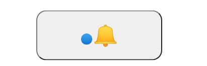
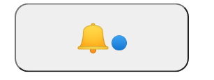

# Pseudo-classes

The pseudo-classes are used to define a special state of an element

Normally they're used like temporararly styles for an element.

They're declared as it follows `selector:pseudoClass`

The most used are: `:hover, :active, :before, :after`

```css
button:hover {
  color: red;
}
```


```css
button:active {
  color: red;
}
```


Two importants pseudo selectors are the `:before` and `:after` these properties allow us to introduce content before or after a element, via the CSS could be useful to make a little indicator or something like that.

The `:before` introduces before the element

```css
button:before{
    content: "🔵";
}
```



The `:after` introduces after the element

```css
button:after{
    content: "🔵";
}
```



