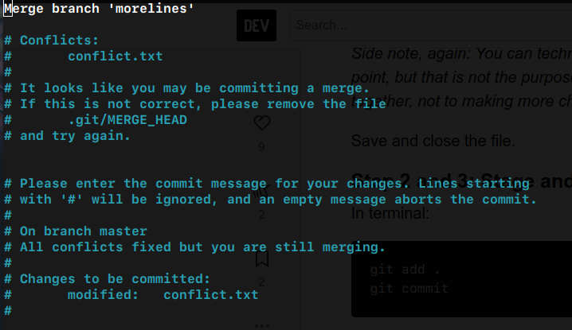
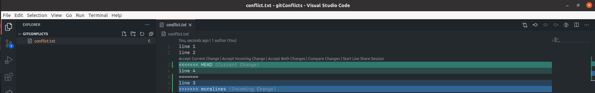
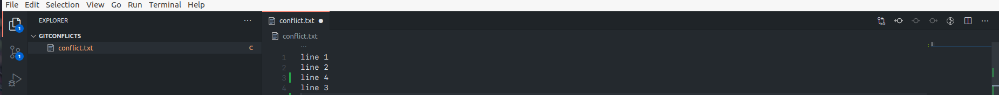

# Resolve conflicts

## Merging conflicts with CLI

A conflict happens when a developer A wants to merge his code to another branch, but the developer B had edited the same line, and in this case a conflict appears, thats because Git detects there's two "versions" of this line and dont know wich is the correct, and the create a conflict and lets you to decide which one of them is the correct, or even say both are correct.

When we have a merge we need to do the next:

First of all we need to try the merge the branch

```text
git merge morelines
```

And then git will thell there's a conflict

```text
Auto-merging conflict.txt
CONFLICT (content): Merge conflict in conflict.txt
Automatic merge failed; fix conflicts and then commit the result.
```

And when this appens we need to fix the files that had failed, and git will highlight the areas to better diferntiation.

```text
line 1
line 2
<<<<<<< HEAD
line 4
=======
line 3
>>>>>>> morelines
```

We can see that in the third line we have the conflict, because in the tird line two different values are declared, we need to decide if we delete one or we keep both. Note that we have the to markers `<<<<<HEAD` and `>>>>>>>morelines` thats because with is below the `HEAD` is the actual text that's in the branch which we want to merge the document, and what is on top of the `morelines` is what we have in the morelines branch. 



```text
line 1
line 2
line 3
```



```
line 1
line 2
line 4
```



We can delete one, or keep both. We're going to keep both.

```text
line 1
line 2
line 3
line 4
```

Finally we can stage this changes an commit them.

```text
git add .
git commit
```

When we commit we'll have a generated file to commit the merge, we can save it and do the commit, and the merge will be fully completed.



## Merging conflicts with Visual Studio Code

If we're using VSCode it's a lot easier and intuictive to merge conflicts.

When we do the merge the same will appear:



Here we can click the buttons to accept the incoming changes, the current changes or even both changes, we will accept both.

And thats is, the both will appear, and we're ready to make `git add .` and  `git commit`and merge finally.




