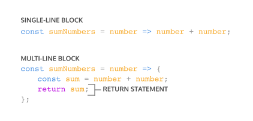

# JavaScript Functions

A function is a reusable block of code that groups together a sequence of statements to perform a specific task.


A parameter is a named variable inside a function's block which will be assigned the value of the argument passed in when the function is invoked.


To call a function in the code 


ES6 introduces new ways of handling arbitrary parameters through _default parameters_ which allow us to assign a default value to a parameter in case no argument is passed into the function.

```javascript
function multiply (a , b=2) {
    return a * b;
};

multiply(4,4);
>>> 16

multiply(3);
>>>6
```


To return a value from a function, we use a return statement.

```javascript
return greetWorld;
```


### There are several ways to define a function

To define a function using function expressions:


To define a function using arrow function notation:


Function definition can be made concise using concise arrow notation:




