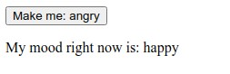
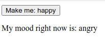

# React Component States

The Component States is similar to props, but it's private, fully controlled by the component and can be only used with `Class`, we can access to the key that we want by using `this.state.keyWanted`

```jsx
import React from "react";
import ReactDOM from "react-dom"

class Mood extends React.Component {
    constructor(props) {
        super(props)
        this.state = { mood: 'nice' }
    }

    render() {
        return (
            <div>{this.state.mood}</div>
        )
    }
}

ReactDOM.render(<Mood />, document.getElementById('root'))
//Will render "nice" to the DOM
```

We also can update this state by using `this.setState`

```jsx
import React from "react";
import ReactDOM from "react-dom"

class Mood extends React.Component {
    constructor(props) {
        super(props)
        this.state = { mood: 'happy' };
        this.updateState = this.updateState.bind(this)

    }
    updateState() {
        const newMood = this.state.mood === 'happy' ? 'angry' : 'happy'
        this.setState({ mood: newMood })
    }

    updateButtonText() {
        const buttonNewMood = this.state.mood === 'angry' ? 'happy' : 'angry'
        return buttonNewMood
    }

    render() {
        return (
            <>
                <button onClick={this.updateState}>Make me: {this.updateButtonText()}</button>
                <p>My mood right now is: {this.state.mood}</p>
            </>
        )
    }
}
ReactDOM.render(<Mood />, document.getElementById('root'))
```





